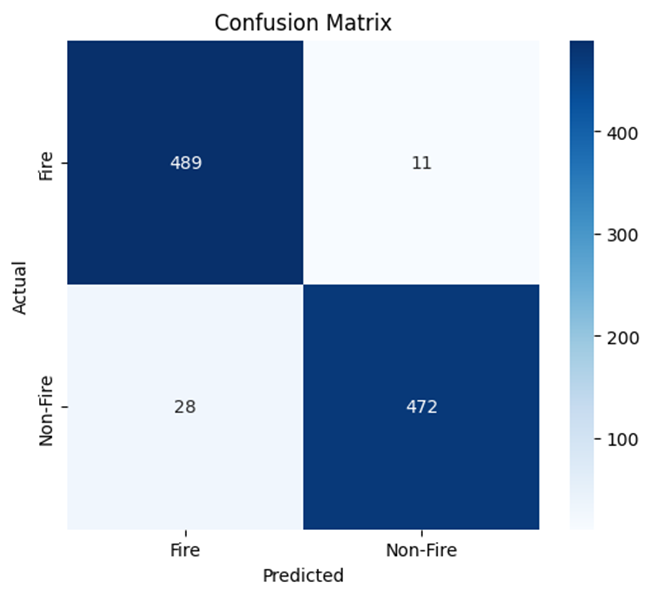
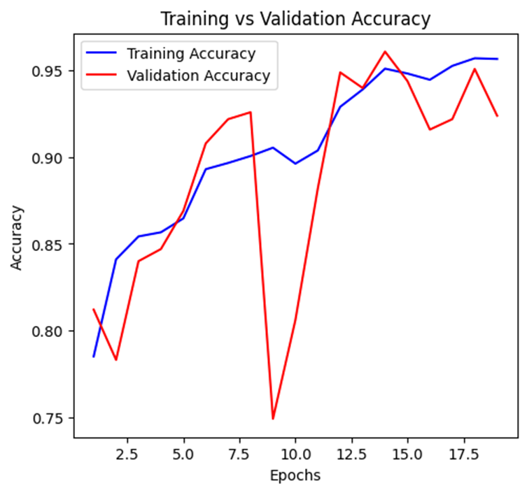
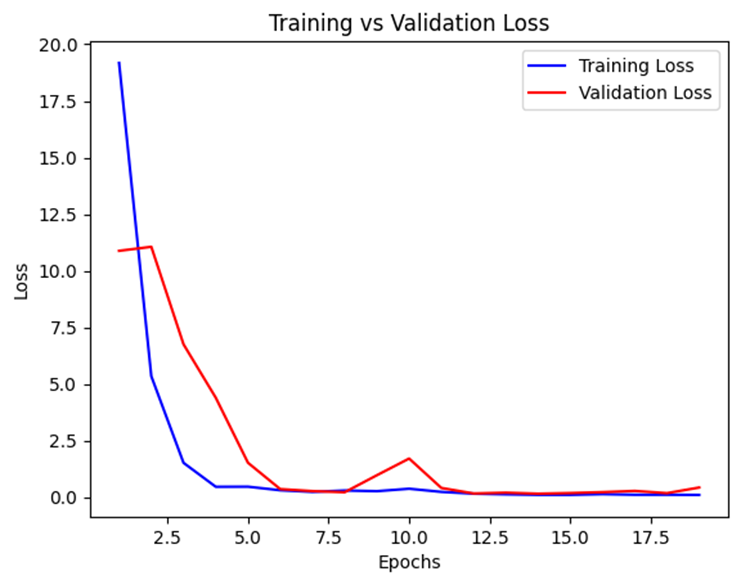

# FlameGuard: Efficient Forest Fire Recognition with MSA-Net

[](https://opensource.org/licenses/MIT)
[](https://www.python.org/downloads/)
[](https://www.tensorflow.org/)

FlameGuard is a lightweight, high-accuracy deep learning system designed for the early detection of forest fires. By leveraging a **Multi-Scale Attention Network (MSA-Net)** integrated with **Squeeze-and-Excitation (SE) blocks**, this model achieves highly accurate, real-time fire detection optimized for edge devices like drones and IoT monitoring stations.

## 📖 Abstract
Forest fires pose a severe threat to ecosystems, biodiversity, and human life. Traditional detection methods often suffer from delayed response times and high false positive rates. FlameGuard addresses this by utilizing multi-scale convolutional layers to capture varied spatial patterns (from fine smoke details to large flames). The addition of SE blocks allows the network to adaptively recalibrate channel-wise feature responses, focusing on critical fire indicators while actively suppressing background noise like fog or sunlight. 

## ✨ Key Features
* **Lightweight & Edge-Ready:** Designed with a compact parameter count (~2.8 million), making it ideal for deployment on resource-constrained hardware.
* **Multi-Scale Feature Extraction:** Parallel 3x3, 5x5, and 7x7 convolution filters capture fire patterns at varying distances.
* **Attention Mechanism:** Dynamic channel-wise recalibration via SE blocks enhances sensitivity to relevant features.
* **High Reliability:** Proven to significantly minimize false positives and false negatives, which is critical for real-world safety applications.

## 📊 Performance & Results
The model was trained and evaluated on a curated, balanced dataset of fire, smoke, and non-fire images. It achieved an outstanding **test accuracy of 96.10%**.

| Metric | Score |
| :--- | :--- |
| **Accuracy** | 96.10% |
| **Precision (Fire)** | 0.95 |
| **Recall (Fire)** | 0.98 |
| **F1-Score (Fire)** | 0.96 |

### Visualizing Performance
 

 

## 🛠️ Tech Stack
* **Deep Learning Framework:** TensorFlow / Keras
* **Computer Vision:** OpenCV
* **Data Processing:** NumPy
* **Visualization & Metrics:** Matplotlib, Seaborn, Scikit-learn

## 🚀 Getting Started

### 1. Clone the Repository
```bash
git clone [https://github.com/yourusername/FlameGuard.git](https://github.com/yourusername/FlameGuard.git)
cd FlameGuard
```

### 2. Install Dependencies
Ensure you have Python 3.8+ installed. Install the required packages:
```bash
pip install -r requirements.txt
```

### 3. Usage Structure
The repository is modularized for clean execution:
* `src/model.py`: Contains the MSA-Net architecture and SE-block logic.
* `src/train.py`: Script to train the model with Early Stopping and Learning Rate reduction.
* `src/evaluate.py`: Generates the confusion matrix and classification reports.

## 🎓 Academic Context
This project was developed as a B.Tech Final Year Project at the Department of Computer Science and Engineering.

* **Institution:** Sree Vidyanikethan Engineering College (Affiliated to JNTUA)
* **Project Guide:** Dr. K. Reddy Madhavi (Professor, Dept of CSE)

**Development Team:**
* Ramayanam Mahidhar
* Battala Chandralahari
* Singireddy Udayadithya Reddy
* Kankatalanss Sukesh Kumar


